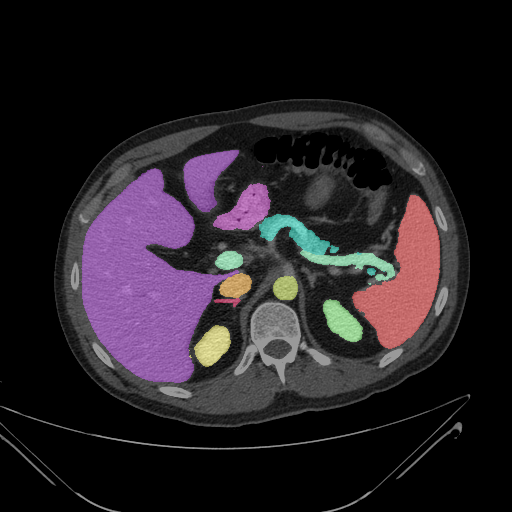
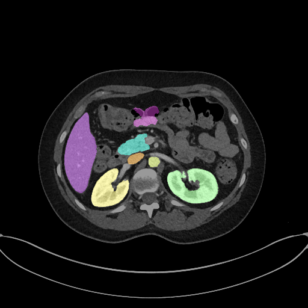

# 2D State-of-the-art method for Abdominal Multi-organ Segmentation.pytorch

The purpose of this repository is to maintain a version of state-of-the-art segmentation method for general medical image segmentation tasks.

Current version: 
Resnet101 based atrous convolutional nerual network. (a modified version of DeeplabV3)
April, 2020


This is a PyTorch implementation of the 2D state-of-the-art method backbone of DeepLabV3, parameters and changes are done to fit CT/MRI data and medical image segmentation.
The original paper:[DeepLabv3](https://arxiv.org/abs/1706.05587) that aims to reuse the [resnet implementation in torchvision](https://github.com/pytorch/vision/blob/master/torchvision/models/resnet.py) as much as possible. This means we use the [PyTorch model checkpoint](https://github.com/pytorch/vision/blob/master/torchvision/models/resnet.py#L13)

We try to match every detail in original network, except to fit for medical segmentation tasks. 


(GPU with at least 11GB memory is required). Also support the combination of Group Normalization + Weight Standardization:

Implementation | Normalization | Multi-Grid | ASPP | Image Pooling | mIOU
--- | --- | --- | --- | --- | ---
Paper | BN | (1, 2, 4) | (6, 12, 18) | Yes | 77.21
Ours | BN | (1, 1, 1) | (6, 12, 18) | Yes | 76.49
Ours | GN+WS | (1, 1, 1) | (6, 12, 18) | Yes | 77.20

To run the BN experiment, after preparing the dataset as follows, simply run:
```bash
python main.py --train --exp bn_lr7e-3 --epochs 50 --base_lr 0.007
```
## Prepare BTCV MICCAI2015 Challenge Data Dataset
```bash
mkdir data
cd data
```
|  |   |  |


## Prepare PASCAL VOC 2012 Dataset
```bash
mkdir data
cd data
wget http://host.robots.ox.ac.uk/pascal/VOC/voc2012/VOCtrainval_11-May-2012.tar
tar -xf VOCtrainval_11-May-2012.tar
cd VOCdevkit/VOC2012/
wget http://cs.jhu.edu/~cxliu/data/SegmentationClassAug.zip
wget http://cs.jhu.edu/~cxliu/data/SegmentationClassAug_Visualization.zip
wget http://cs.jhu.edu/~cxliu/data/list.zip
unzip SegmentationClassAug.zip
unzip SegmentationClassAug_Visualization.zip
unzip list.zip
```

## Prepare Cityscapes Dataset
```bash
unzip leftImg8bit_trainvaltest.zip
unzip gtFine_trainvaltest.zip
git clone https://github.com/mcordts/cityscapesScripts.git
mv cityscapesScripts/cityscapesscripts ./
rm -rf cityscapesScripts
python cityscapesscripts/preparation/createTrainIdLabelImgs.py
```
